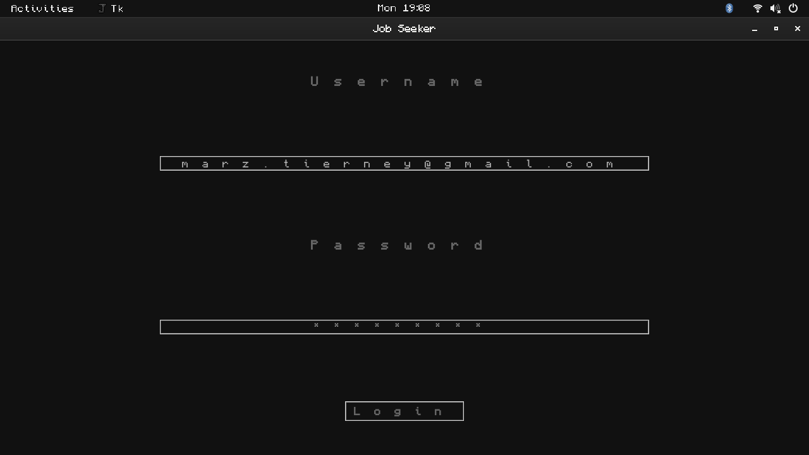
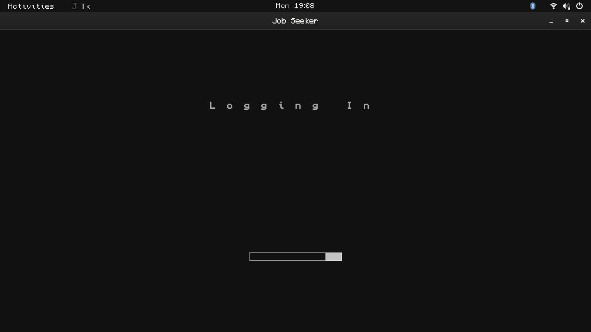

A quick and dirty app, automates/assists job seeking.

    - Saves encrypted password
    - Scans job search terms
    - Saves job application states
    - Applies for jobs with resume and cover letter

  

    
    
Screenshot 1

  

  

    
    
Screenshot 2

  

  

    
    
Screenshot 3

  

